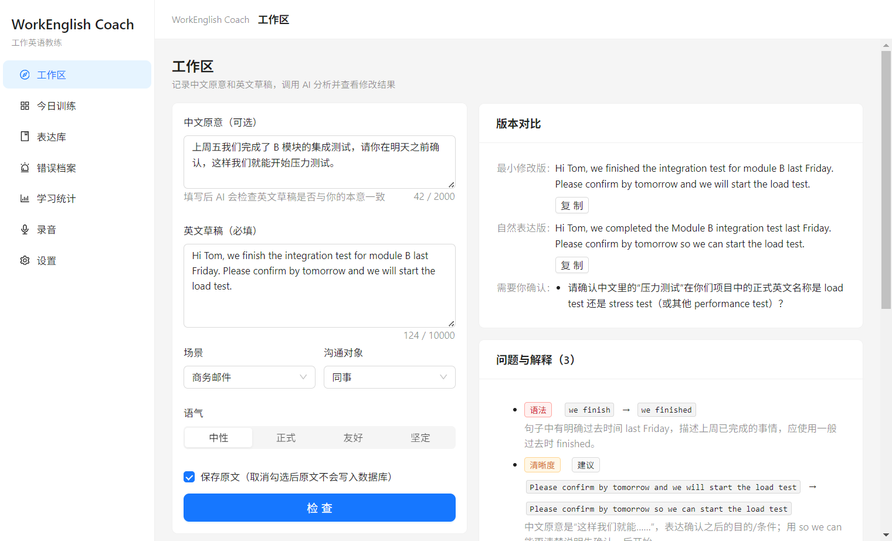
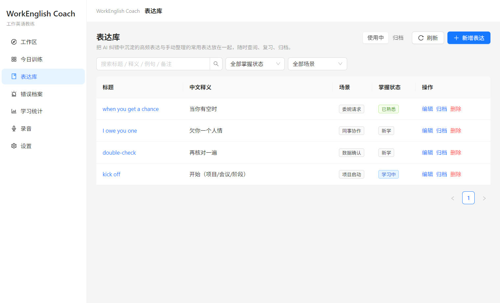
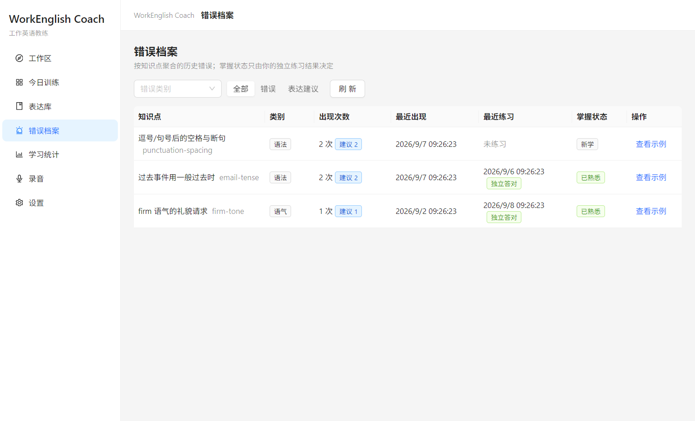
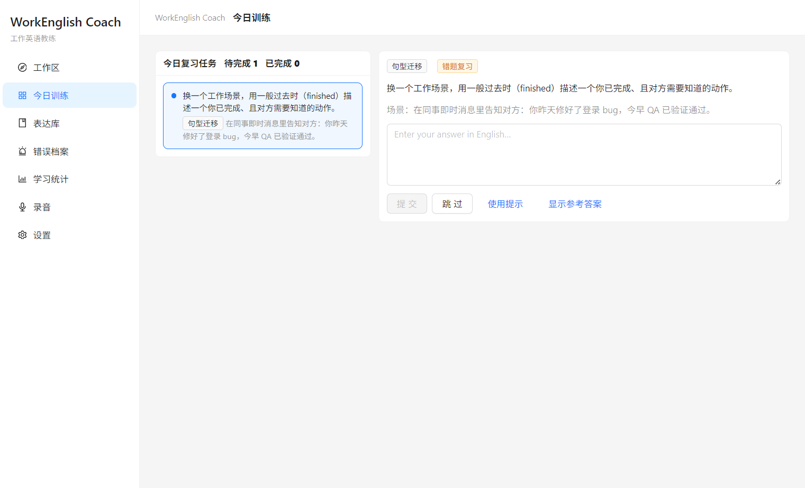
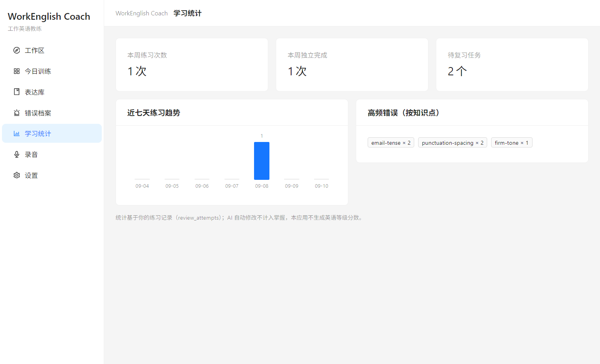
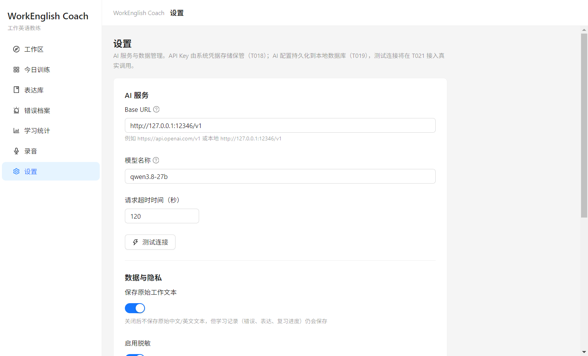

# WorkEnglish Coach

只供我自己使用的 Windows 桌面应用：辅助提升**工作场景中的英语书面表达和口语表达能力**。



> **数据与隐私**：全部数据只存在于本机（SQLite 数据库 + Windows 系统密钥环）。
> 应用不会连接任何外部网络——唯一的网络请求是你在设置页显式配置后、由你主动触发的 AI 端点请求。
> 不自动读取其他应用，不自动发送任何邮件或聊天消息，无云同步、无多用户。

---

## 核心闭环

1. **输入**：在「工作区」填写中文原意（可选）和英文草稿（必填），选择场景 / 沟通对象 / 语气。
2. **AI 检查**：返回**最小修改版**和**自然表达版**，并解释主要错误（语法 / 表达 / 语气 / 清晰度分类标注）。
3. **确认保存**：核对 AI 是否改动了对事实的承诺（日期、数字、承诺程度），确认无误后保存。
4. **提取**：AI 提取错误对应的**知识点**（技能）和值得积累的**表达**。
5. **生成复习**：基于知识点/表达生成复习任务，按间隔调度（1 → 3 → 7 → 14 → 30 天）。
6. **隔天训练**：在「今日训练」里用**新的场景**重新输出，AI 评价是否独立掌握。
7. **统计**：「学习统计」展示掌握进度、高频错误和 7 天活跃趋势。

> 设计原则：AI 的修改不算掌握——只有你在不同场景里独立复现，才计入掌握进度。

## 功能模块

| 模块 | 说明 |
| --- | --- |
| **工作区** | 输入草稿 → AI 返回两版改写 + 问题解释；需确认项单独提示（AI 不得擅自改动事实/承诺） |
| **今日训练** | 5 种题型（改写 / 纠错 / 改语气 / 场景迁移 / 自由输出），AI 评分 + 改进版；支持查看提示/参考答案、跳过/下一题 |
| **表达库** | 积累工作中有用的表达（用法、适用场景、掌握状态：new → learning → familiar） |
| **错误档案** | 全部历史错误，按类别 / 严重度 / 状态（open / learning / closed）筛选 |
| **学习统计** | 掌握进度、高频错误知识点、7 天活跃趋势 |
| **录音** | 录音（`.webm`）、试听、AI 逐条评价、重新录制 |
| **设置** | AI 端点配置与连接测试、数据导出 / 导入 / 删除、清除 API Key |








## 快速上手

1. **安装**：从 [Releases](../../releases) 下载 `WorkEnglish Coach Setup x.y.z.exe` 安装（或解压 `win-unpacked.zip` 免安装运行）。
2. **配置 AI**：打开「设置」，填入任意 **OpenAI 兼容端点**：
   - `Base URL`（如 `http://127.0.0.1:12346/v1`）
   - `Model ID`（如 `qwen3.8-27b`）
   - `API Key`（可选，本地服务可为空）
   点「测试连接」确认连通（发送一个最小 ping 请求）。
3. **开始检查**：「工作区」填写中文原意和英文草稿 → 点「检查」→ 查看两版改写和问题解释 → 确认无误后「保存」。
4. **每天练 10 分钟**：打开「今日训练」，完成到期题目。

## AI 配置说明

- **API Key 存储**：通过 Windows 系统密钥环（[keytar](https://github.com/atom/node-keytar)）存储，**不进入 SQLite 数据库、不进入导出文件**。导出数据库不会泄露 Key；「清除 API Key」从密钥环独立删除。
- **超时**：所有 AI 请求默认 120 秒超时（可配置）；超时 / 网络错误 / 解析失败分别归类展示，不会静默失败。
- **输出校验**：所有 AI 返回结构经过 Zod schema 校验，非法结构会优雅降级（保留草稿、展示错误，不写入脏数据）。
- **敏感信息**：可选开启脱敏（redaction），发送前对可能的敏感字段做处理；「保存原文」开关控制原始草稿是否入库。
- **约束**：提示词明确禁止 AI 改动日期、数字、人物、责任人和承诺程度；此类改动会作为「需要你确认」单独列出。

## 数据管理

- 数据库文件：`%APPDATA%/workenglish-coach/work-english-coach/work-english-coach.db`（首次启动自动建表，迁移脚本随包内置）。
- **导出**：JSON 格式全量导出（设置 → 数据），包含知识点 / 表达 / 样本 / 错误 / 复习任务与记录 / 设置。
- **导入**：先备份再合并；主键冲突时跳过并报告。
- **删除**：一键清空 6 张学习数据表（设置中的 AI 配置保留，API Key 不受影响）。
- 录音文件：`%APPDATA%/workenglish-coach/work-english-coach/recordings/`。

## 复习机制

- **5 种题型**：`rewrite`（改写）/ `correction`（纠错）/ `tone`（改语气）/ `transfer`（场景迁移）/ `free`（自由输出）。
- **调度**：首次 1 天后到期；答对按 1 → 3 → 7 → 14 → 30 天间隔延长（原地更新 `scheduledAt`）；答错回到 1 天重试。
- **毕业**：连续 2 次「独立正确」（未用提示、核心意思正确）即毕业，不再排期。
- **评分维度**：核心意思 / 语法 / 语气 三个维度 + AI 文字反馈 + 改进版参考答案。

## 开发与构建

### 环境要求

- Windows 10/11，Node.js ≥ 20（开发机用 v24）
- MSYS/Git Bash 或任意 shell

### 常用命令

```bash
npm install          # 安装依赖
npm run dev          # 开发模式（vite + electron，热更新）
npm test             # 单元测试（Vitest，227 个）
npm run typecheck    # tsc --noEmit
npm run lint         # ESLint
npm run smoke        # 冒烟测试（启动打包产物验证 CDP/页面）
npm run screenshots  # 重新生成 docs/screenshots 下的演示截图（--with-ai 含真实 AI 结果）
npm run package:win  # 构建 NSIS 安装程序（release/）
```

### 目录结构

```
src/
  main/       # Electron 主进程
    db/       #   SQLite（node:sqlite）+ Drizzle schema/迁移/仓库
    ipc/      #   IPC handler（按功能分文件）
    services/ #   AI 客户端/分析/评分/调度/统计/录音/错误档案等业务服务
    windows/  #   主窗口
  preload/    # 最小化、类型安全的 desktopAPI（contextIsolation + sandbox）
  renderer/   # React + Ant Design 页面（工作区/训练/表达库/错误档案/统计/录音/设置）
  shared/     # 主/渲染共享：类型、常量、纯逻辑（调度计算/统计/输入校验等，带单测）
tests/        # Vitest（服务/仓库/纯逻辑）
docs/         # 设计文档（01-09）
```

### 测试 AI 相关功能

本机测试可用：`http://127.0.0.1:12346/v1`，模型 `qwen3.8-27b`，无需 Key（reasoning 模型，响应约 1-4 分钟）。

## 技术栈

Electron 33 · React 19 · TypeScript 5.9 · Vite（electron-vite）· Ant Design 5 · Zustand · SQLite（`node:sqlite` + Drizzle ORM）· Zod · Vitest · electron-builder（NSIS）· keytar

## 设计文档

见 `docs/`：01 产品与架构 · 02 数据库 · 03 IPC API · 04 错误处理 · 05 AI 提示词 · 06 错误档案与统计 · 07 复习机制 · 08 任务清单 · 09 E2E 测试。
